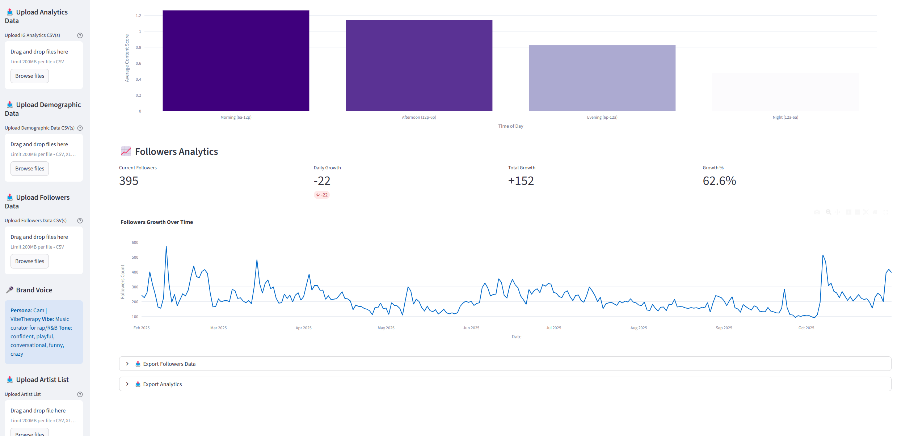

---
<p align="center">
  Instagram Chatbot  
</p>

<table width="100%">
  <tr>
    <td align="center" valign="top">
      <a href="" target="_blank">
        
      </a>
      <a href="" target="_blank">
        
      </a>
      <br><br>
      <strong><a href="https://www.tembo.io/?utm_source=github&utm_medium=readme&utm_campaign=prompt_repo_sponsorship" target="_blank">Put any coding agent to work while you sleep</a></strong>
      <br>
      <a href="https://www.tembo.io/?utm_source=github&utm_medium=readme&utm_campaign=prompt_repo_sponsorship" target="_blank">Tembo – The Background Coding Agents Company</a>
      <br><br>
      <a href="https://www.tembo.io/?utm_source=github&utm_medium=readme&utm_campaign=prompt_repo_sponsorship" target="_blank">[Get started for free]</a>
    </td>
    <td align="center" valign="top">
      <a href="https://latitude.so/developers?utm_source=github&utm_medium=readme&utm_campaign=prompt_repo_sponsorship" target="_blank">
        
      </a>
      <br><br>
      <strong><a href="https://latitude.so/developers?utm_source=github&utm_medium=readme&utm_campaign=prompt_repo_sponsorship" target="_blank">Make your LLM predictable in production</a></strong>
      <br>
      <a href="https://latitude.so/developers?utm_source=github&utm_medium=readme&utm_campaign=prompt_repo_sponsorship" target="_blank">Open Source AI Engineering Platform</a>
      <br><br>
      &nbsp;
    </td>
  </tr>
</table>

---

## 🛠️ Installation

### Prerequisites

- Python 3.11+
- OpenAI API key

### Setup Steps

1. **Install dependencies**

```bash
pip install -r requirements.txt
```

2. **Run the application**

```bash
streamlit run app.py
```

3. **PostgreSQL Database Setup**

Your app requires a PostgreSQL database. Follow these steps to set it up on a Mac:

1) **Install PostgreSQL**

If PostgreSQL is not installed on your Mac, install it via Homebrew:

```bash
brew install postgresql
brew services start postgresql
```

You can verify it’s running with:

```bash
psql --version
```

2) **Create a Database**

Create a new database for the app:

```bash
psql postgres
```

Then inside the psql shell:

```sql
CREATE DATABASE insta_analytics;
\q
```

3) **Import insta_analytics.sql**

Navigate to the folder containing the SQL file (assuming it’s in your project directory):

```bash
cd ~/Downloads/IG_Prov1
psql -d insta_analytics -f insta_analytics.sql
```

This will populate your database with the tables and initial data needed for the app.

4) **Configure Database Connection**

Update your streamlit/secrets.toml with the correct credentials:

```toml
[postgres]
host = "localhost"
port = 5432
user = "<YOUR_DB_USERNAME>"
password = "<YOUR_DB_PASSWORD>"
database = "insta_analytics"
```

Replace <YOUR_DB_USERNAME> and <YOUR_DB_PASSWORD> with your PostgreSQL credentials (default user is usually your Mac username).


4. **Run automatically at Mac startup**
To start the Streamlit app automatically when your Mac turns on:

1) **Using Login Items**

- **Make a file named run_streamlit.command in your project folder (~/Downloads/IG_Prov1) with this content:**
    #!/bin/bash
    cd ~/Downloads/IG_Prov1 || exit
    if [ -d "venv" ]; then
        source venv/bin/activate
    fi
    streamlit run app.py --server.address 0.0.0.0 --server.port 8501
    exec $SHELL

- **Make it executable in Terminal:**

```bash
chmod +x ~/Downloads/IG_Prov1/run_streamlit.command
```

- **Add the .command file to System Settings → General → Login Items.**

2) **Using a Launch Agent**

- **Create a file ~/Library/LaunchAgents/com.cameron.streamlit.plist with this content:**

```xml
<?xml version="1.0" encoding="UTF-8"?>
<!DOCTYPE plist PUBLIC "-//Apple//DTD PLIST 1.0//EN"
"http://www.apple.com/DTDs/PropertyList-1.0.dtd">
<plist version="1.0">
<dict>
    <key>Label</key>
    <string>com.cameron.streamlit</string>

    <key>ProgramArguments</key>
    <array>
        <string>/bin/bash</string>
        <string>-c</string>
        <string>cd ~/Downloads/IG_Prov1 && streamlit run app.py --server.address 0.0.0.0 --server.port 8501</string>
    </array>

    <key>RunAtLoad</key>
    <true/>
    <key>KeepAlive</key>
    <true/>
</dict>
</plist>
```

- **Load it in Terminal:**

```bash
launchctl load ~/Library/LaunchAgents/com.cameron.streamlit.plist
```

- **To stop it later:**

```bash
launchctl unload ~/Library/LaunchAgents/com.cameron.streamlit.plist
```

**Your app will now start automatically whenever your Mac boots up.**


5. 🌐 **Access from Other Devices on the Same Network**

Once your Streamlit app is running, you can open it on your phone or another device connected to the same Wi-Fi network:

1. **Find your Mac’s local IP address:**

```bash
ipconfig getifaddr en0
```

2. **Open the app on your phone:**

http://<YOUR_LOCAL_IP>:8501


Example: http://192.168.1.45:8501

Replace <YOUR_LOCAL_IP> with the IP returned in step 1.
Make sure both devices are connected to the same Wi-Fi network.
    

## 📁 Project Structure

```
├── app.py                           # Main Streamlit application
├── config.py                        # Configuration settings
├── requirements.txt                 # Python dependencies
├── brand_voice.yaml                 # Brand voice configuration
├── run_streamlit.command            # Command to run Streamlit automatically
├── insta_analytics.sql              # Dump file of PostgreSQL DB
├── streamlit/
│   ├── secrets.toml                 # Postgres db info
├── chat/
│   ├── chat_interface.py            # Chat interface
│   ├── chat_pipeline.py             # Chat pipeline
│   ├── langchain_chat_workflow.py   # Chat workflow with langchain and toll calls
└── exports/                         # Generated exports and saved examples
├── generators/
│   ├── content_generator.py         # AI content orchestration
│   ├── poll_generator.py            # Poll generation
│   ├── quiz_generator.py            # Quiz generation
│   └── reel_generator.py            # Reel script generation
│   └── scoring_engine.py            # Score Engine for all generated content
├── utils/
│   ├── analytics_engine.py          # Instagram analytics processing
│   ├── artist_list_manager.py       # Artist list filtering
│   ├── export_manager.py            # CSV export
│   ├── postgres_manager.py          # Management my data from Postgres DB
│   ├── process_upload.py            # Upload analytics data and artist list file into postgres DB
```
